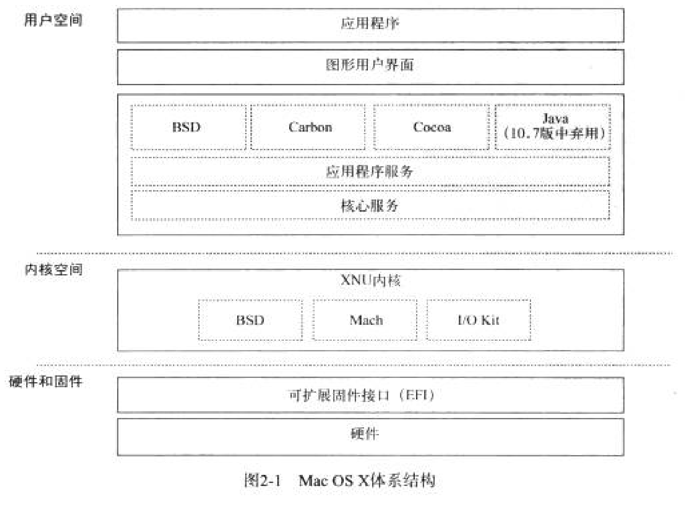
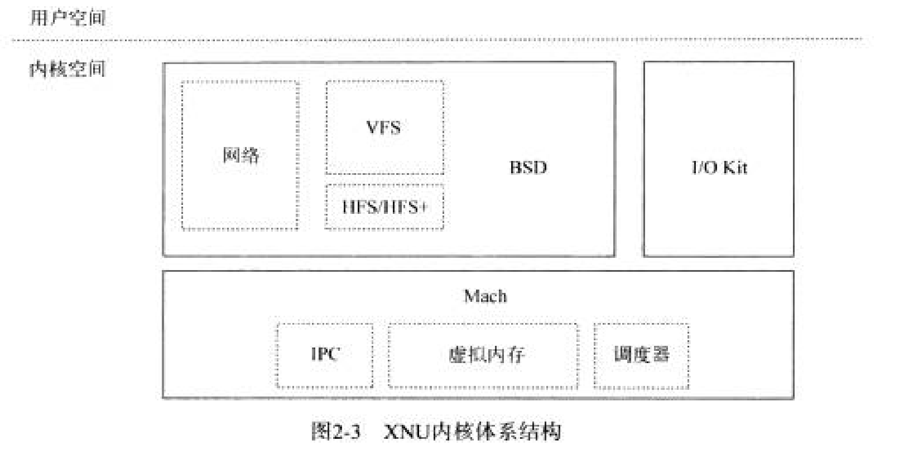
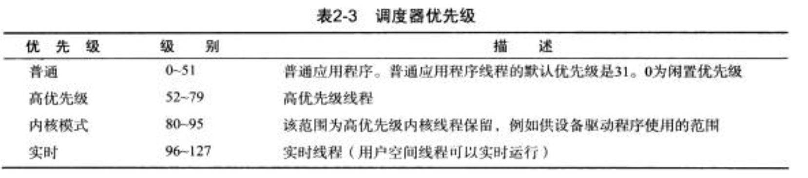

# Mac OS X and iOS

## 编程API

Cocoa 

Objective-C

Cocoa Touch(iOS)

## 支持的平台

## 64位操作系统

## iOS

# Xnu内核

## 内核扩展（KEXT)

内核扩展两个主要类

	1.用于基于I/O Kit的内核扩展,硬件驱动程序（c++)
	2.通用内核扩展，从新网络协议到文件系统的任何内容，与BSD或Mach层交互（c)

## Mach

进程间通信（IPC)

### 1.任务和线程

任务包含一个或多个可执行线程，至少包含一个线程。

### 2.调度

分时调度，分配时间量子（10毫秒）

基于优先级调度

内核将线程组织到双向链表中，链表集合称为运行队列。

每个优先级都有一个链表（0-127）。

系统中的每个处理器负责维护自己的运行队列结构。

某个线程优先级降低到某一程度时会进行优先级重置

### 3.Mach IPC:端口和消息

端口是一个单向通信端点。

端口有保护机制，称为端口权限，

权限与任务相关，任务内的线程共享端口权限。

权限可以在任务之间复制或移动

子进程不能继承父进程的端口权限（mach没有进程的概念）

一组端口称为端口集，消息队列由端口集中的所有端口共享。系统中端口地址为32位整数。

Mach IPC系统还可在用户空间应用程序中使用，用于任务之间或任务向内核传递消息。

### 4.mach异常

发生异常时，内核将挂起引起异常的线程，并向线程的异常处理端口发送IPC消息。

如果线程不处理该异常，则该异常将转送给包含该任务的异常端口，最终转送给系统（主机）的异常端口。

线程默认的异常端口为PORT_NULL，除非明确分配一个端口，否则由任务的异常端口来处理。

当进程fork一个子进程时，子进程继承父进程的异常端口。

### 5.时间管理

实时时钟，日历时钟和高分辨率时钟

### 6.内存管理

Mach VM

### 7.任务地址空间

每一个Mach任务都有其自己的虚拟地址（VM)空间。

内核本身有自己的任务，即kernel_task,有自己独立的地址空间。不映射到每个任务的地址空间。

### 8.VM映射和VM映射项

看不懂

### 9.物理映射

### 10.VM对象

看不懂

### 11.检查任务的地址空间

vmmap

### 12.分页器

	1.默认分页器
	2.虚拟节点分页器
	3.设备分页器

### 13.mach中的内存分配

基本例程：

	kmem_alloc()
	kmem_alloc_contig()
	kmem_alloc_aligned()
	kmem_free()

## BSD

### 系统调用

### 网络

### 文件系统

### 虚拟文件系统

### I/O Kit

家族：特定设备类型的一般抽象
驱动程序：负责管理特定的设备或总线
块：可控制实体（如PCI或USB设备）的接口

1.libkern库

2.Platfrom Expert

处理系统总线的枚举和检测

