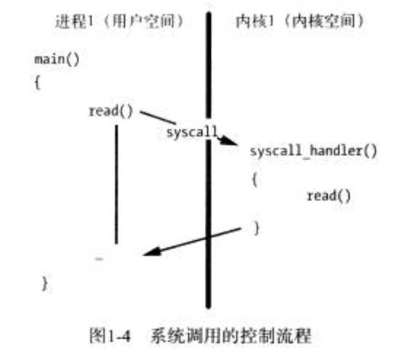
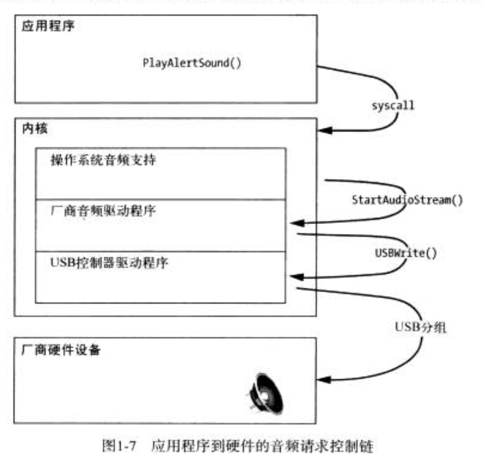

# 操作系统原理

## 操作系统的作用

## 进程管理

进程：正在执行的程序，包括程序代码，程序分配的内存内存以及当前的执行状态

## 进程地址空间

操作系统为每个进程提供了一段可操作的内存，我们成为进程的地址空间。

## 操作系统服务

## 虚拟内存

让应用程序以为自己拥有一段连续的内存，其实应用程序拥有的内存是不连续且动态变化的物理内存

## 调度

进程彼此独立运行，都有各自的地址空间，以防止一个进程影响其他进程的行为。

对操作系统来说，线程是调度的基本单位。

一个线程会在可用的CPU上调度执行，直到发生以下情况：

	1.过了一定时间（时间量子）后。
	2.线程在等待操作（如从磁盘读取数据或另一个线程返回结果）完成时，将不能执行。线程还可以调用sleep函数主动放弃CPU.

## 硬件和驱动程序

驱动程序的分层

ioctl直接与驱动程序通信

